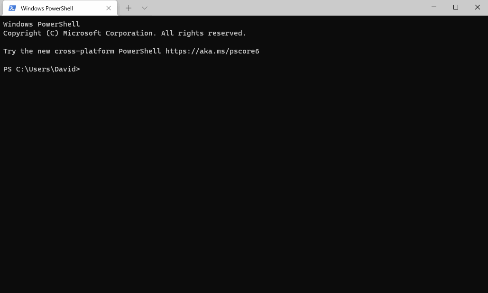

# VANDIX Calculator

A Docker container that calculates the Vancouver Area Neighborhood Deprivation Index for varying geographies.

To use, make a folder in the current directory called 'data'. Then run the following command:

```
docker run -it -v data:/data/ dswanlund/vandix
```


Note that if you want to calculate VANDIX for dissemination areas that intersect with a particular shapefile, ensure that you put that shapefile in the data folder beforehand.


